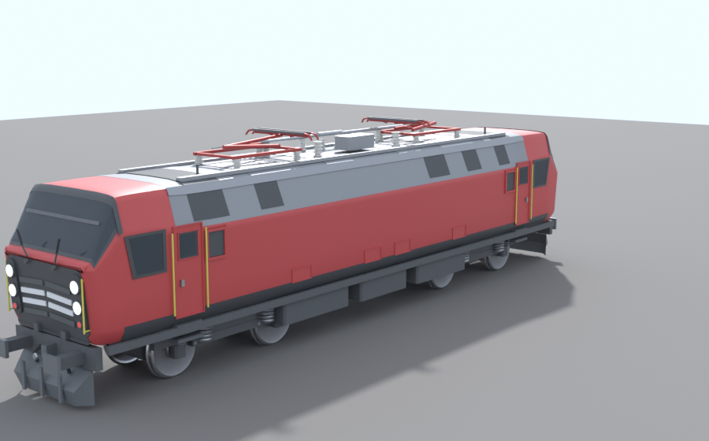

# Vectron for Derail Valley

A procedurally generated model of a Siemens Vectron style electric locomotive,
built for import into Derail Valley through
[Custom Car Loader](https://github.com/derail-valley-modding/custom-car-loader).

The model is not a mesh file that was drawn by hand - it is *generated* by a
small Python program in this folder. That means the shape is parametric: change
a dimension in `vectron/dims.py` or a cross section in `vectron/body.py`, run
the build again and every LOD, both bogies and all four corners update
together. No external dependencies are needed for the geometry itself; Blender
is only used for the FBX/glTF export.



## Quick start

```bash
cd Tools/VectronModel

# geometry only - writes OBJ + MTL + preview PNGs, needs nothing but Python 3.10+
python3 build_vectron.py --out dist --livery red --lod all --preview

# full export for Unity - needs Blender 4.x, or `pip install bpy`
python3 blender_pipeline.py --out dist --livery red
# or:  blender --background --python blender_pipeline.py -- --out dist --livery red
```

Outputs in `dist/`:

| File | Purpose |
| --- | --- |
| `vectron_<livery>_lod0..3.obj` + `.mtl` | plain geometry, imports anywhere |
| `vectron_<livery>.blend` | full scene with the CCL hierarchy and materials |
| `vectron_<livery>.fbx` | **the file to drag into Unity** (Y up, Z along the car) |
| `vectron_<livery>.glb` | for quick viewing / web preview |
| `hierarchy.json`, `model_info.json` | object tree and dimensions, for tooling |

### Options

| Flag | Values | Notes |
| --- | --- | --- |
| `--livery` | `white`, `black`, `red`, `blue`, `dv` | plain colours, no operator branding |
| `--variant` | `ac`, `ms`, `de` | `de` replaces the pantographs with an exhaust and radiators |
| `--panto-raise` | `0.0` … `1.0` | 0 = folded on the roof, 1 = raised to working height |
| `--lod` | `0`…`3`, `all` | LOD0 is the detailed one |
| `--axes` | `yup`, `zup` | `yup` (default) for Unity, `zup` for Blender/generic tools |

## Dimensions

Taken from the published main dimensions of the type; anything that is not
public (panel positions, equipment layout) is reconstructed from photographs
and kept plausible rather than invented freely.

| | |
| --- | --- |
| Length over buffers | 18.980 m |
| Body length | 17.900 m |
| Width | 3.012 m |
| Height over roof (pantograph down) | 4.220 m |
| Bogie pivot distance | 9.900 m |
| Bogie wheelbase | 3.000 m |
| Wheel diameter | 1.250 m |
| Coupler / buffer centre height | 1.050 m (what CCL expects) |
| Buffer spacing | 1.750 m |
| Wheel arrangement | Bo'Bo' |

## Polygon budget

CCL suggests 25k–56k vertices for a locomotive exterior and up to 14k per
bogie. LOD0 lands at roughly 26k vertices / 47k triangles including both
bogies, the cab interiors and both pantographs, so there is headroom for
texture-driven detail later.

The Python `--lod` levels reduce the cross-section count and drop small parts.
The Blender pipeline additionally builds LOD1–3 as Decimate copies at 50 %,
25 % and 12.5 %, which is the ratio the CCL wiki recommends.

## How the geometry is built

```
vectron/
  dims.py         every reference dimension, in one place
  mesh.py         dependency free mesh toolkit (boxes, revolves, lofts, tubes)
  materials.py    material table and the liveries
  body.py         cross sections, the lofted shell, cab front, glazing, doors
  roof.py         roof hatches, HV equipment, single arm pantograph
  bogie.py        Bo'Bo' bogie: frame, wheelsets, springs, brakes, drives
  underframe.py   frame, equipment boxes, head stock, buffers, plough
  interior.py     a simple cab interior, visible through the windscreen
  build.py        assembles everything and records the CCL parenting
  exporters.py    OBJ/MTL writer and the web viewer payload
  preview.py      software renderer (z buffer + PNG writer, no dependencies)
```

The body shell is one closed loft through parametric cross sections. A section
is a vertical side wall, a straight inward chamfer at the shoulder and a narrow
almost flat roof - the shape that makes a Vectron recognisable from any angle.
Because every section has the same vertex layout, any longitudinal band of the
surface can be regenerated with a small outward offset; that is how the grey
roof, the shoulder louvres, the window surrounds and the windscreen are placed
onto the shell without a single boolean operation.

The cab front is the same loft: between the brow and the front face the roof
height drops along a straight line, which produces the raked windscreen. The
front then ends in a fillet instead of a flat cap, so the face rolls into the
body sides with a radius rather than a hard 90° edge.

## Importing into Derail Valley (Custom Car Loader)

1. Set up the CCL car creation project in **Unity 2019.4.40**, colour space
   **Linear**, and run the simulation wizard to generate the car type, livery
   and prefab.
2. Drag `vectron_<livery>.fbx` into the project. Scale factor 1, **Convert
   Units off**, import normals **From model**, import materials on.
3. Drop the model into the car prefab, then select it and run
   **Tools > Vectron > Prepare imported model** (`unity/VectronCclSetup.cs`).
   It strips Blender's `.001` suffixes from `[axle]`, `bogie_car` and the
   coupler rig objects, and converts the exported collider proxy boxes into
   real `BoxCollider`s.
4. Keep the template's `BogieF` / `BogieR` if you prefer - then just move the
   wheel meshes under their `[axle]` transforms. The exported bogies already
   sit at ±4.95 m with the axles at ±1.5 m from the bogie centre.
5. Check that `[coupler_rig_front]` / `[coupler_rig_rear]` sit at X = 0,
   Y = 1.05 and move the buffer anchors just outside the buffer pads.
6. Assign your shaders to the materials (the FBX ships plain Principled/Standard
   colours), then **Export Car** and let the CCL validator run.

The names the exporter already produces:

```
Vectron_193
├── Vectron_Body / _Glass / _Handrails / _RoofEquipment / _Underframe / _CabInterior
├── Pantograph_F, Pantograph_R          (separate objects, ready to animate)
├── BogieF > bogie_car > [axle] > BogieF_axle1 …
├── BogieR > bogie_car > [axle] > BogieR_axle1 …
├── [coupler_rig_front] / [coupler_rig_rear] > BuffersAndChainRig, buffer anchors
└── [colliders] > [collision] / [walkable] / [items] / [bogies]
```

## Texturing

The exporter writes world-space box projected UVs. They are good enough for
tiling materials and for a first look in game, but a painted livery with
lettering needs a proper unwrap - open the `.blend`, unwrap the body and bake
from there. Texture sizes should stay at 2048×2048 for the exterior, as the CCL
wiki recommends.

## Note on the prototype

Vectron is a Siemens Mobility product and the name and logos are their
trademarks. This is a fan-made approximation built from published dimensions
and photographs for use in a game; it carries **no manufacturer or operator
logos, no lettering and no numbering**, and the liveries are plain colours
rather than copies of an operator's design. Add markings only if you have the
right to use them.
